<div align="center">

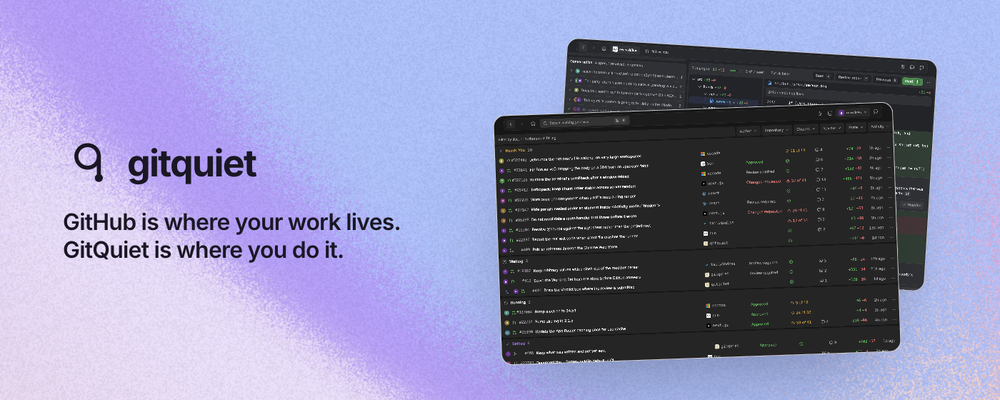

**A faster, quieter GitHub.**
GitHub is where your work lives. GitQuiet is where you do it.

[Install for Chrome](https://chromewebstore.google.com/detail/gitquiet/ichobjnihnofjkpoegikjhefmoekaahe) · [gitquiet.com](https://gitquiet.com) · [Licence](#licence)

</div>

---

GitHub splits a pull request by record type: Conversation, Commits, Checks, Files.
None of those four tabs answers the question you opened it with, so you read all
of them and work it out again on the next visit.

GitQuiet is its own interface on that data, and it files everything by what needs
you. It opens on github.com's own addresses, in Primer tokens and Octicons, so it
follows whichever theme you already use. Their header, nav and repository tabs
are left exactly as they are.

## Four groups

Every list uses the same four, and the words are the product's own vocabulary
rather than a description of it.

| Group | Means |
| --- | --- |
| **Needs You** | You can act on it now. |
| **Waiting** | Someone else has to act. |
| **Running** | A machine is still working. Nothing to do but wait. |
| **Settled** | Finished. Nothing left to do. |

## What it looks like

Every pull request you are in, across repositories, in one list.

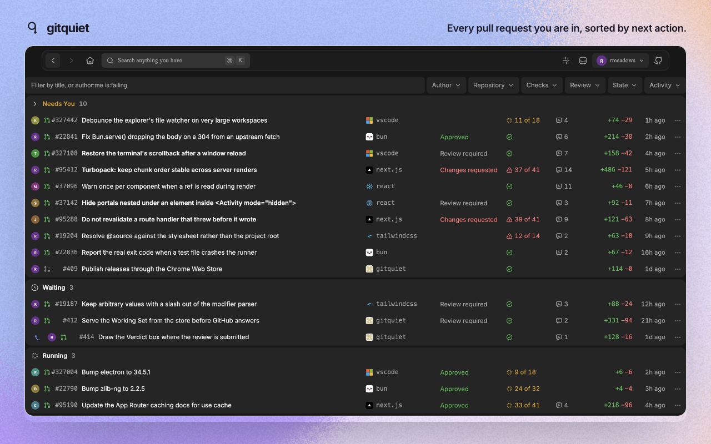

One pull request: unresolved threads, failing checks and the commits pushed since
you last looked, all above the diff.

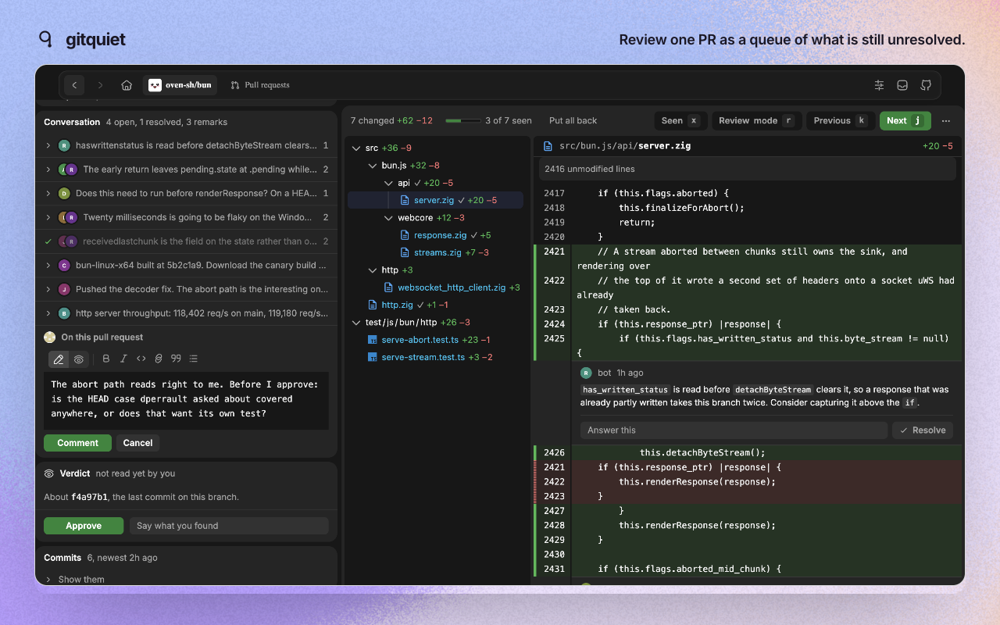

<details>
<summary>The rest of the screens</summary>

| | |
| --- | --- |
| 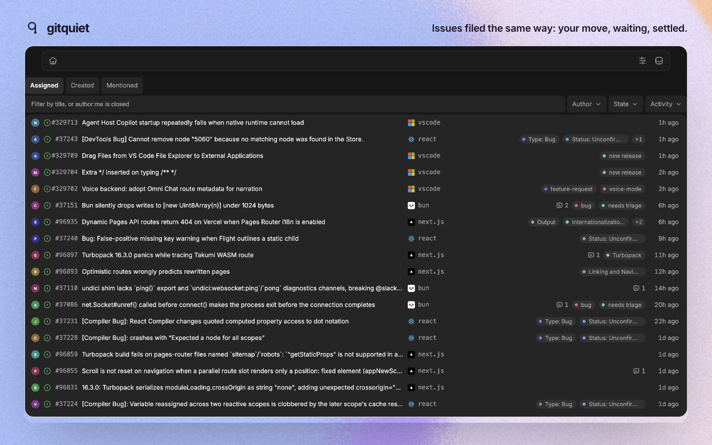 | 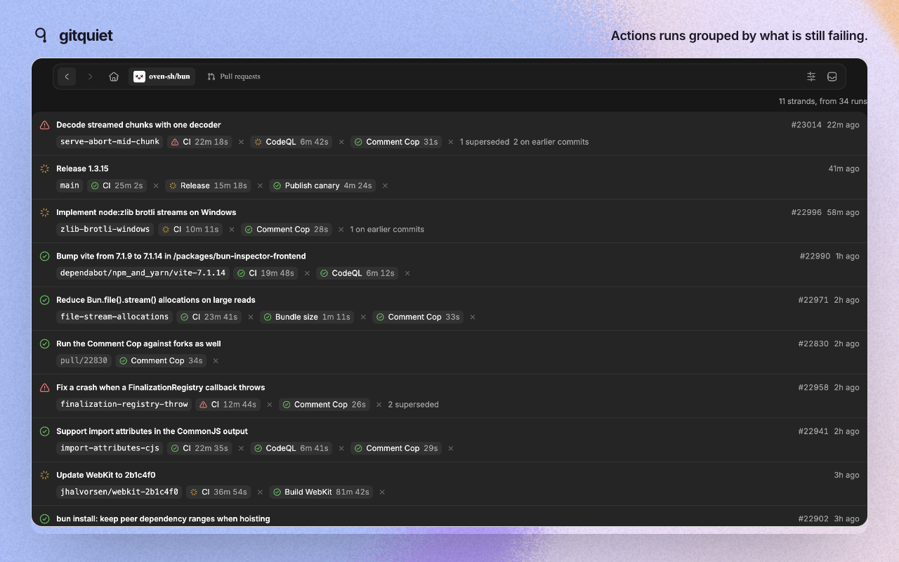 |
| 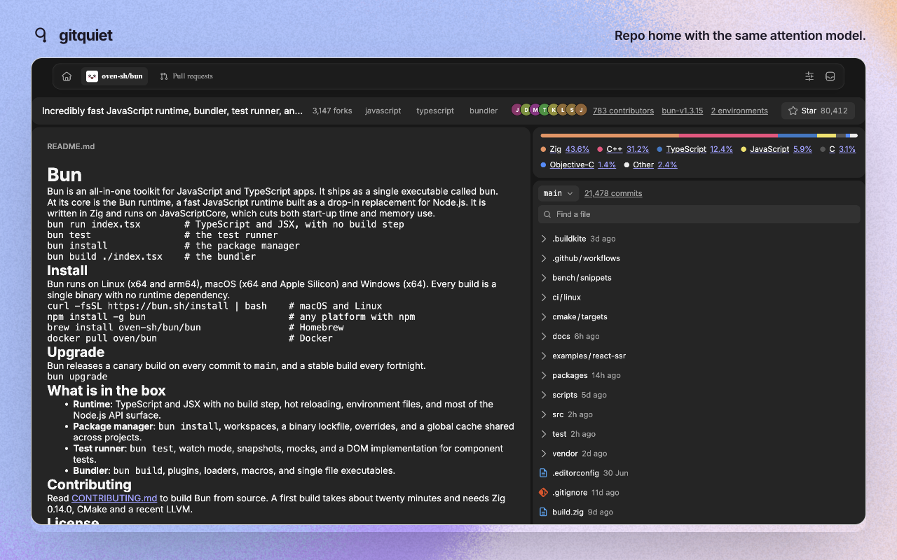 | 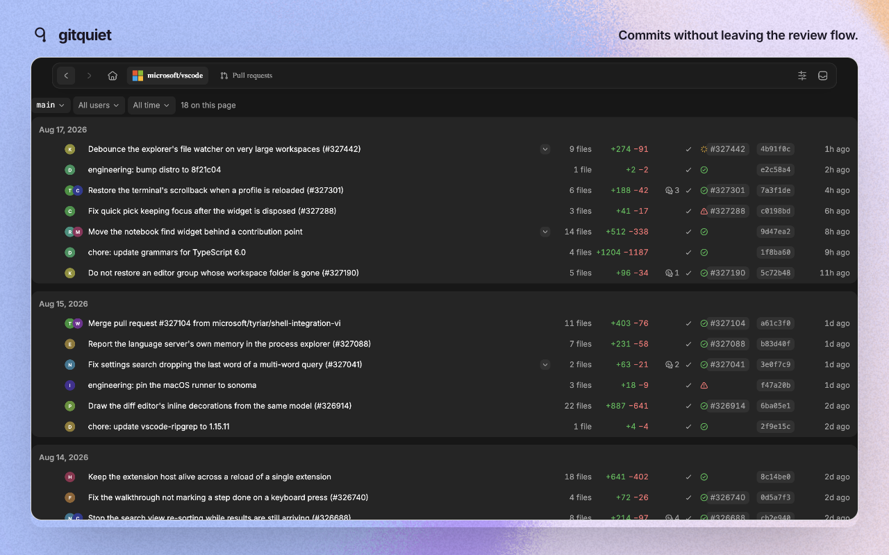 |
| 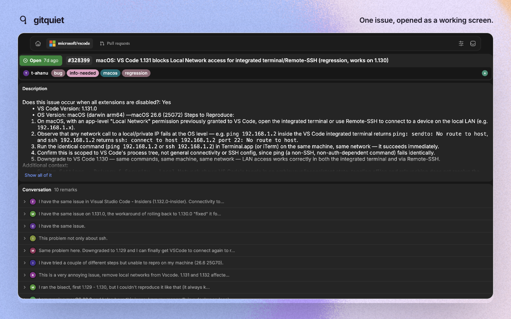 | 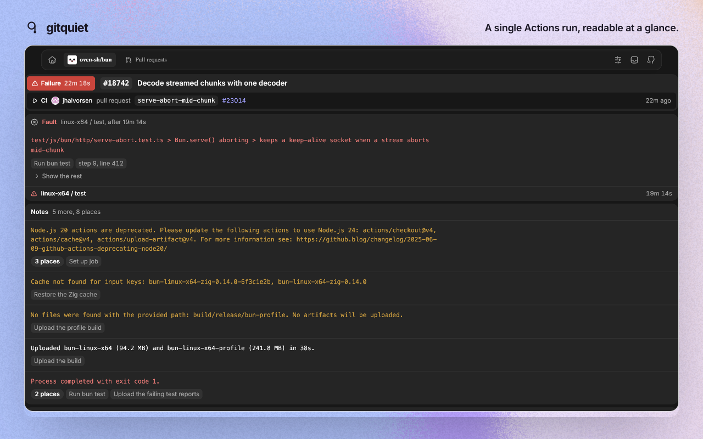 |
| 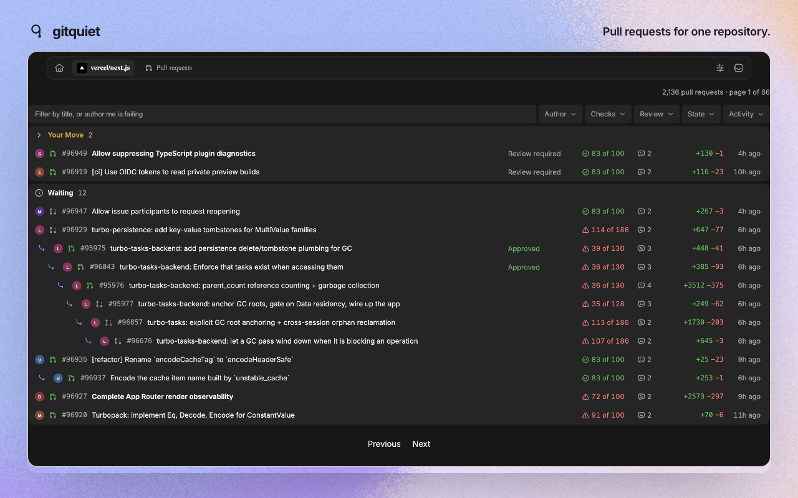 | 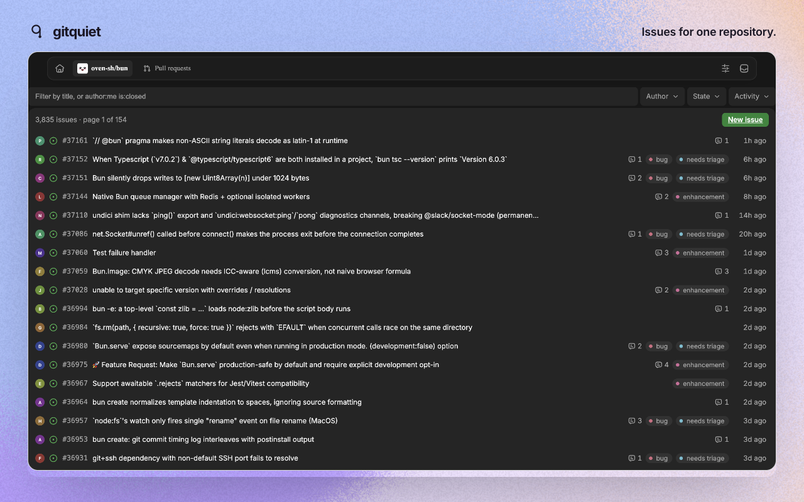 |
| 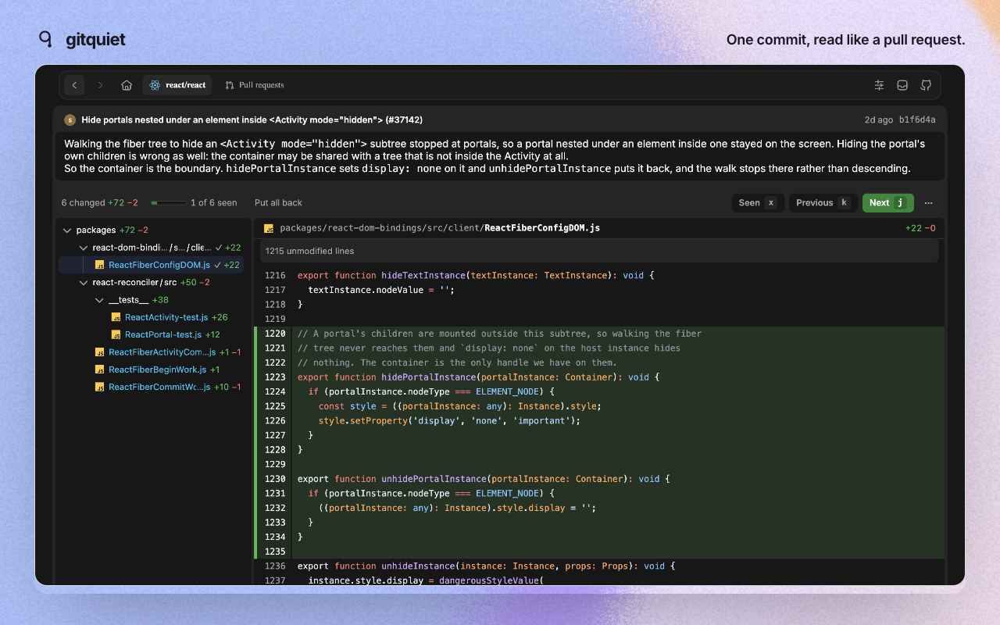 | 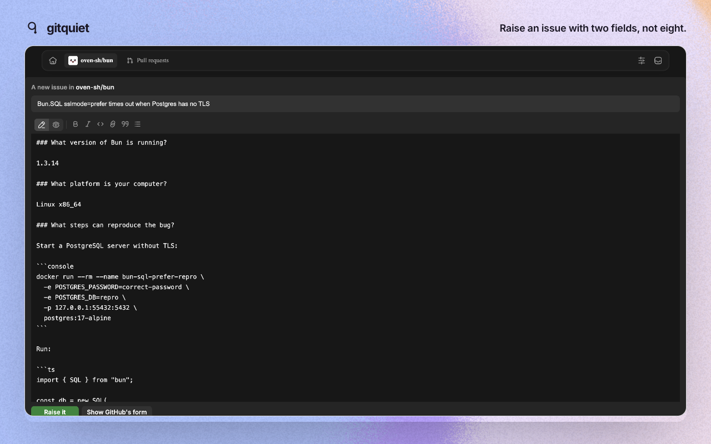 |

</details>

## The fourteen pages

Listed in [`src/ui/place.ts`](./src/ui/place.ts), which is the one list both the
router and the takeover read.

| | |
| --- | --- |
| `/` and `/dashboard` | the home dashboard |
| `/pulls` | your pull requests |
| `/issues` | your issues |
| `/owner/repo` | a repository's front page |
| `/owner/repo/pulls` | its pull requests |
| `/owner/repo/issues` | its issues |
| `/owner/repo/issues/new` | raising one |
| `/owner/repo/issues/N` | one issue |
| `/owner/repo/pull/N` | one pull request |
| `/owner/repo/commits/BRANCH` | a branch's commits |
| `/owner/repo/commit/SHA` | one commit |
| `/owner/repo/actions` | workflow runs |
| `/owner/repo/actions/runs/ID` | one run |
| `/notifications` | your inbox |

## Keyboard

Three profiles, in [`src/keys/commands.ts`](./src/keys/commands.ts): `standard`,
`vim`, and `off` for anyone who wants GitHub's own shortcuts back untouched. A
profile changes which keys reach a command, never what the command does.

| Key | Does |
| --- | --- |
| `j` `k` | next and previous file, or `n` and `p` |
| `x` | mark the file read |
| `O` | open the row in a tab of its own |
| `/` | search |
| `Escape` | dismiss |
| `g d` `g r` `g f` `g h` | working set, repositories, activity, home |

## Privacy

There is no account and no server of ours. GitQuiet uses the GitHub session you
already have, and your code and reviews stay in your browser. Every review,
comment and merge goes back through GitHub, so a colleague who has never
installed it sees your work exactly as usual.

Error reporting is compiled in only when `VITE_SENTRY_DSN` is set at build time,
and nothing in this repository sets it. See
[`src/observability/sentry.ts`](./src/observability/sentry.ts).

## How it is built

| Concern | Choice |
| --- | --- |
| Toolchain | Bun for install, scripts and tests |
| Extension | WXT, Chrome MV3 |
| UI | React 19 and Tailwind 4 over GitHub's Primer tokens and Octicons |
| Domain and data | Effect v4: typed errors, Layers, Schema, Schedule |
| Local store | `storage.local`, reachable from the content script and the worker |
| Tests | `bun test`, `effect/testing`, Testing Library, happy-dom |

The domain, the ports and the screens do not know what they are running inside.
That is what lets [`desktop/`](./desktop) import the same `src/domain`, `src/app`,
`src/ports` and `src/ui` and draw them in an Electrobun window instead of on
GitHub's page, reaching GitHub through the documented API with a token rather
than through page routes with a cookie.

Effect v4 differs from v3 in ways worth knowing before writing code: `Either` is
`Result`, `Effect.catchAll` and `Effect.orElse` are gone in favour of
`Effect.catch`, and `@effect/vitest` is v3 only. Test clocks and property testing
come from `effect/testing`.

## Build it yourself

```sh
bun install          # also clones the Effect source and generates WXT types
bun run compile      # typecheck
bun test             # unit and behaviour tests
bun run dev          # load the extension in a dev browser
bun run build        # production build into .output/chrome-mv3
bun run drift        # re-check GitHub's live payloads against our schemas
```

To load it by hand: `bun run build`, then open `chrome://extensions`, enable
Developer mode, choose Load unpacked, and select `.output/chrome-mv3`. Open any
pull request.

For Firefox, `RELEASE_VERSION=0.2.1 bun run zip:firefox` writes
`.output/gitquiet-0.2.1-firefox.zip` and the sources archive beside it. Without
`RELEASE_VERSION` the build carries version `0.0.0`, which is what a local build
wants and what a store rejects.

### Building from the source archive

Mozilla asks a reviewer to rebuild the extension from the sources zip attached
to a version. That archive is not a clone: there is no git repository in it, and
`bun install` runs a prepare hook that installs git hooks and clones the Effect
source, neither of which a reviewer needs.

```sh
bun install --ignore-scripts   # the prepare hook needs a git repository
bun run types                  # writes .wxt/tsconfig.json, which the build reads
bun run build
RELEASE_VERSION=0.2.1 bun run zip:firefox
```

`.output/gitquiet-0.2.1-firefox.zip` comes back out, the same 2.71 MB as the
uploaded one.

`bun run drift` needs a session cookie and is not part of CI; see
[`fixtures/README.md`](./fixtures/README.md). `bun install` clones the Effect
source to `.repos/effect` so its API can be read rather than guessed. It is
gitignored.

## Where to start reading

- [`CONTRIBUTING.md`](./CONTRIBUTING.md) — the gates, the words, and what a change looks like.
- [`CONTEXT.md`](./CONTEXT.md) — the glossary. The code uses these terms exactly.
- [`docs/spec/`](./docs/spec) — what each screen is for.
- [`src/ui/place.ts`](./src/ui/place.ts) — how a page is taken over.
- [`site/`](./site) — the landing page. [`desktop/`](./desktop) — the macOS app.

## Release

Publish a GitHub release with a version tag:

```sh
gh release create v0.1.0 --generate-notes
```

The workflow checks the tag, builds the extension, attaches the ZIP to the
release, and submits it for Chrome Web Store review. Chrome updates installed
copies once Google publishes it.

Submitting needs `CHROME_EXTENSION_ID`, `CHROME_CLIENT_ID`, `CHROME_CLIENT_SECRET`
and `CHROME_REFRESH_TOKEN` as repository secrets. `bunx wxt submit init` walks
through the Google Cloud setup. Do not commit the `.env.submit` it writes.

## Contributing

Three gates decide whether a change can land, and `bun install` writes the git
hooks that run them before a push rather than after it:

```sh
bun run gates   # oxlint over src, then tsc --noEmit, then the whole suite
```

[`CONTRIBUTING.md`](./CONTRIBUTING.md) says what the linter enforces and why,
and what a commit message here looks like. Open an issue first for anything that
changes a screen.

Found a security problem? Do not open an issue. See
[`SECURITY.md`](./SECURITY.md).

## Licence

[GNU AGPL v3 or later](./LICENSE). Run it, read it, change it, share it. If you
run a modified version as a network service, its users are entitled to its
source.

The licence covers the code and not the name or the logo. A fork is welcome and
needs its own name. See [NOTICE](./NOTICE).

GitHub is a trademark of GitHub, Inc. This project is not affiliated with,
endorsed by, or sponsored by GitHub.
